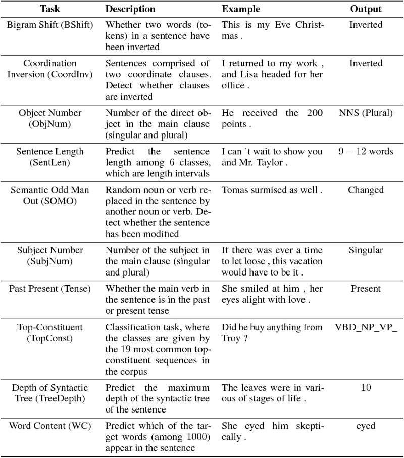

# Notes on FAQs ChatBot

## To Dos

- Need  deep understanding of some complex topic like "semantic similarity via embedding" 
- Read papers, implement word2vec by numpy, huggingface, practically use Spacy, 
- Be up to date with advances in field and GLUE index, T5, tf hub models. 
- Build slide desk for workshop on Vectorization, quora dataset, have py programs first then notebooks for trying all old/new vectorizers
 

## Watch/Read the following
* Embeddings for Everything: Search in the Neural Network Era
https://www.youtube.com/watch?v=JGHVJXP9NHw

* Applying the four step "Embed, Encode, Attend, Predict" framework to predict document similarity
https://www.youtube.com/watch?v=HfnjQIhQzME

* BERT Research https://www.youtube.com/watch?v=FKlPCK1uFrc

* Understanding Text: An exciting journey from Probabilistic Models to Neural Networks
https://confengine.com/odsc-india-2019/proposal/10274/understanding-text-an-exciting-journey-from-probabilistic-models-to-neural-networks

## Queries Posted on Rasa/Stack Overflow Forums
*	https://forum.rasa.com/t/building-faq-chatbot-like-qna-maker/3791 I am building a QnA chatbot, say for College admissions. FAQs related to this are already available in form of pairs of Questions and Answers. For ready frameworks such as “QnA Maker”, I believe, one must supply the faqs and it builds the rest. ...
* 	https://forum.rasa.com/t/rasa-core-sdk-not-working/9228  for rasa_core_sdk not working
* 	https://forum.rasa.com/t/mapping-faq-with-rasa-for-large-dataset-2000/2406
* 	https://forum.rasa.com/t/faq-bot-knowledge-base/742

## Frameworks/Libraries/Datasets (TBD)
*	Quora Duplicate Queries
*	ChatScript: open-source, written in C and C++, and publicly available on GitHub for everyone to study and adopt.
*	Pandorabots: allows businesses to create and host their own chat bots that can have human-like text or voice chats with customers. Parts of this bot platform are licensed under GPL. Pandorabots supports AIML, an XML dialect for creating natural language software agents. Pandorabots provides the base bot Rosie as a template for creating your own. Rosie is available on Github, and is a set of AIML and AIML 2.0 files which can form the base for any chatbot project.
*	IBM Watson: The first choice as a bot-building platform for 61% of businesses. Python SDK. Free plan.
*	Microsoft Bot Framework: own Bot Builder SDK that includes .NET SDK and Node.js SDK.  It is possible to incorporate LUIS for natural language understanding, Cortana for voice, and the Bing APIs for search.
*	Wit.ai: Free. Python.
*	Api.ai: Google. Python.
*	Chatfuel: More than 360,000 chatbots have been created using Chatfuel, serving more than 17 million users globally. Free.
*	ChatterBot: Python.
*	Chatscript: A rule-based engine. Rules are created in program scripts through a process called dialog flow scripting.
*	Rasa NLU has HTTP API and Python support, intent classification, and entity extraction [19]; it is an open source tool that runs locally.
Platforms like IBM Watson, Microsoft Bot Framework, Api.ai, ChatScript and Pandorabots were developed ten or more years ago. Therefore, their experience provides the most advanced tools and offers the most flexible solutions for businesses.

## NTMC Community
Community Question Answer is to automatically search for relevant answers among many responses provided for a given question (Answer Selection), and search for relevant questions to reuse their existing answers (Question Retrieval).

Some benchmark datasets are listed in the following,

- WikiQA [https://www.microsoft.com/en-us/download/details.aspx?id=52419] is a publicly available set of question and sentence pairs, collected and annotated for research on open-domain question answering by Microsoft Research.
- TRECQA [https://trec.nist.gov/data/qa.html] dataset is created by Wang et. al. from TREC QA track 8-13 data, with candidate answers automatically selected from each question’s document pool using a combination of overlapping non-stop word counts and pattern matching. This data set is one of the most widely used benchmarks for answer sentence selection.
- SemEval-2015 Task 3 [http://alt.qcri.org/semeval2015/task3/] consists of two sub-tasks. In Subtask A, given a question (short title + extended description), and several community answers, classify each of the answer as definitely relevance (good), potentially useful (potential), or bad or irrelevant (bad, dialog, non-english other). In Subtask B, given a YES/NO question (short title + extended description), and a list of community answers, decide whether the global answer to the question should be yes, no, or unsure.
- SemEval-2016 Task 3 [http://alt.qcri.org/semeval2016/task3/] consists two sub-tasks, namely Question-Comment Similarity and Question-Question Similarity. In the Question-Comment Similarity task, given a question from a question-comment thread, rank the comments according to their relevance with respect to the question. In Question-Question Similarity task, given the new question, rerank all similar questions retrieved by a search engine.
- SemEval-2017 Task 3 [http://alt.qcri.org/semeval2017/task3/] contains two sub-tasks, namely Question Similarity and Relevance Classification. Given the new question and a set of related questions from the collection, the Question Similarity task is to rank the similar questions according to their similarity to the original question. While the Relevance Classification is to rank the answer posts according to their relevance with respect to the question based on a question-answer thread.

## Experts/Conferences/Journals (TBD)
*	SemEval
*	Ishwar Sawale, Pune https://www.linkedin.com/in/ishwarsawale/ (“robot” on rasa forum)
*	Shailesh S Sarda, Pune https://www.linkedin.com/in/shailesh-s-sarda-85a8a2124/ 
*	Jitesh Gaikwad, Mumbai https://www.linkedin.com/in/jitesh-gaikwad-4b4047b8/
*	Ajinkya Pathak, Pune https://www.linkedin.com/in/ajinkyanpathak/
*	Peeyush Kumar, Bengaluru https://www.linkedin.com/in/peeyushk/

## Paper Summary: Evaluation of sentence embeddings in downstream and linguistic probing tasks
(Ref : https://towardsdatascience.com/paper-summary-evaluation-of-sentence-embeddings-in-downstream-and-linguistic-probing-tasks-5e6a8c63aab1)
* Different Sentence Embeddings
	*	ELMo (BoW, all layers, 5.5B): From AllenNLP, this is the pre-trained ELMo embedding. This was the English representation that was trained on the 5.5B word corpus (a combination of Wikipedia and the monolingual news crawl).
	*	FastText (BoW, Common Crawl): From Facebook. It’s just word embeddings, these are transformed to sentence embeddings through averaging of all words. It has a dimensionality of 300.
	* 	GloVe (BoW, Common Crawl): GloVe, averaged together like other word embeddings. It has a dimensionality of 300.
	*	Word2Vec (BoW, Google News): Word2Vec, averaged together. It has a dimensionality of 300.
	*	Skip-Thought: Uses the word2vec approach of predicting surrounding sentences based on the current sentence. It does this through an encoder-decoder architecture. This is our biggest representation, with 4800 dimensions.
	*	USE (DAN): Google’s basic Universal Sentence Encoder (USE), the Deep Averaging Network (DAN) is available through TensorFlow Hub. USE outputs vectors of 512 dimensions.
	*	USE (Transformer): Finally, Google’s heavy duty USE, based on the Transformer network. USE outputs vectors of 512 dimensions.
* Linguistic Tasks: Again taken from SentEval, there were 10 probing tasks that were conducted to evaluate different linguistic properties of sentence embeddings. These are pretty cool. They were:
	
* Results show that we aren’t at a place where we truly have a solid universal sentence encoder. There is no sentence embedding that performs best on every task and there’s still a lot we can learn through linguistic probing and testing.

## FAQ Chatbot MVP
with Python, Flask, Docker, and Google Cloud Services - Will Scott (Ref: https://towardsdatascience.com/faq-chatbot-mvp-871ab7db94cc)
Github source: https://github.com/willtscott/inquire-boulder-chatbot
* Before you sink a chunk of time into a menial scraping task, take a few minutes to look around and see if you can go straight to the source.
* Similarity Matching
	- Semantic similarity: SpaCy via pre-trained models that consider words to be similar if they are used in similar contexts. Not much impressive.
	- KD Tree is a data structure represented in scikit-learn that is useful for storing K-Nearest Neighbor relationships.
	- Doc2Vec by Gensim results inferior
* Google Cloud Services to host Flask app by wrapping it in a Docker container and running that on a load-balanced Kubernetes cluster to allow for scaling
* The Google App Engine is an alternative
* "I should point out here — As basic as my similarity algorithm is, it still outperforms any of the out-of-the-box ML platforms from the massive Tech Corps services I tested."!!

## The Current Best of Universal Word Embeddings and Sentence Embeddings
(Ref: https://medium.com/huggingface/universal-word-sentence-embeddings-ce48ddc8fc3a)
* There is a general consensus in the field that the simple approach of directly averaging a sentence’s word vectors (so-called Bag-of-Word approach) gives a strong baseline for many downstream tasks.
* Sentence Similarity

## Collection of Good Referemces
* awesome-sentence-embedding https://github.com/Separius/awesome-sentence-embedding

## A chat with Subham Mahanta
*	Basic chatbot is of Question Answers type.
*	AIML is too old, 15-year-old technology, is also like similarity based fetching of answers.
*	Newer approach is database or dictionary based similarity fetching.
*	Dictionary with Question as key and its answer as value. Build such databases, pickle it.
*	Users sentences is matched (cosine similarity) with keys ie questions and the one with most, its answer is given back.
*	Front end can be html css etc
*	For encoding sentences, sklearn’s count vectorizer is good.
*	If the match is below some threshold then say, “Could not understand!!”
*	RASA-NLU type chatbots are call-back based.
*	Its local engine is trained manually for intent and entities identification
*	For each identified intent, a call-back function is programmed with entities as its arguments.
*	Call-back can do processing, call database or API, get the answer, which can be pasted as is.

## References to update the Training Material
*	Dialogs stats , Slot tutorial https://medium.com/datadriveninvestor/build-a-flight-search-chatbot-from-scratch-using-rasa-part-1-47370cf1e53b 
*	The talk would be about Rasa, an open-source chatbots platform - Nathan Zylbersztejn https://www.youtube.com/watch?v=0hZay4KSLFw
*	Conversational AI with Rasa Core & NLU - Tom Bocklisch https://www.youtube.com/watch?v=zRqjH7fT0G0 
*	Start contributing to Rasa https://rasa.com/community/contribute/
*	Rasa NLU+dialog->tex course
*	Full GST chatbot on Heroku w disclaimer then link from Yati.io
*	Rasa Blog https://blog.rasa.com/?_ga=2.169818913.1472851714.1538279040-209190406.1538279040   https://medium.com/rasa-blog  https://medium.com/rasa-blog/tagged/tutorial 
*	Put on your robot costume and be the Minimum Viable Bot yourself ! https://blog.rasa.com/put-on-your-robot-costume-and-be-the-minimum-viable-bot-yourself/ 
*	Datacamp course https://campus.datacamp.com/courses/building-chatbots-in-python/chatbots-101?ex=1 
*	Building a chatbot with Rasa NLU and Rasa Core https://vimeo.com/254777331
*	How to Build a Chatbot with RASA : Complete Guide https://www.datasciencelearner.com/how-to-build-a-chatbot-rasa-complete-guide/
*	Building a chatbot with Rasa https://itnext.io/building-a-chatbot-with-rasa-9c3f3c6ad64d 
*	Rasa Python Weather Chatbot https://medium.com/coinmonks/rasa-python-weather-chatbot-51fc218d346d
*	Supervised Word Vectors from Scratch in Rasa NLU https://medium.com/rasa-blog/supervised-word-vectors-from-scratch-in-rasa-nlu-6daf794efcd8 
*	Building with Rasa: eLearning chatbot https://medium.com/rasa-blog/building-with-rasa-elearning-chatbot-2212399a9b8b 
*	https://github.com/GetStoryline/awesome-bots 
*	Chatbots with Machine Learning: Building Neural Conversational Agents https://blog.statsbot.co/chatbots-machine-learning-e83698b1a91e
